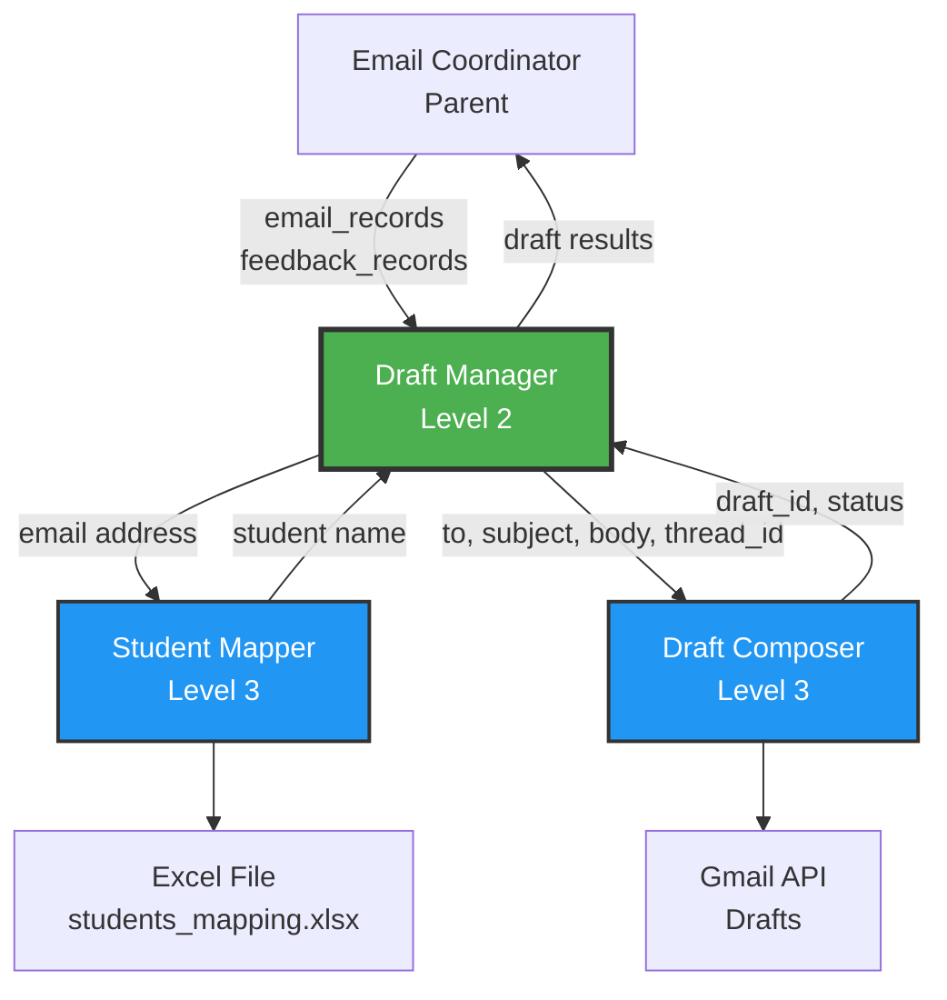
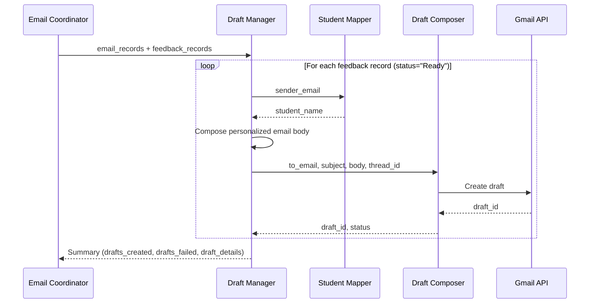

# Draft Manager

> A Level 2 task manager that orchestrates personalized email draft creation by combining student identification with email composition


---

## Table of Contents

- [Overview](#overview)
- [Key Features](#key-features)
- [Architecture](#architecture)
- [Directory Structure](#directory-structure)
- [Prerequisites](#prerequisites)
- [Installation](#installation)
- [Configuration](#configuration)
- [Usage](#usage)
  - [As Part of Email Coordinator](#as-part-of-email-coordinator)
  - [Standalone Execution](#standalone-execution)
  - [Programmatic Usage](#programmatic-usage)
- [Input/Output Specification](#inputoutput-specification)
- [Workflow](#workflow)
- [Child Services](#child-services)
- [Testing](#testing)
- [Troubleshooting](#troubleshooting)
- [Integration Guide](#integration-guide)
- [Contributing](#contributing)

---

## Overview

The **Draft Manager** is a Level 2 task manager in the orchestrator architecture that sits between the Email Coordinator (parent) and two specialized leaf services (children). It's responsible for creating personalized email drafts by mapping student email addresses to their names and composing Gmail draft replies with feedback.

### What It Does

Manages the complete outbound email draft creation workflow:
1. Takes email records and feedback records from the parent Email Coordinator
2. Maps student email addresses to their names using the Student Mapper service
3. Composes personalized email drafts using the Draft Composer service
4. Returns a summary of draft creation results to the parent

### Why It Exists

In an educational email processing system, teachers need to send personalized feedback to students. This module:
- **Automates personalization** by mapping emails to student names
- **Maintains thread continuity** by creating drafts as replies to original emails
- **Provides review capability** by creating drafts (not sending automatically)
- **Centralizes orchestration** of the draft creation workflow

### Use Cases

- Automated homework feedback distribution
- Personalized assignment review emails
- Bulk student communication with individual customization
- Educational email workflow automation

---

## Key Features

✅ **Orchestration** - Coordinates two specialized child services
✅ **Personalization** - Maps email addresses to student names automatically
✅ **Gmail Integration** - Creates drafts via Gmail API for teacher review
✅ **Thread Continuity** - Maintains email conversation threading
✅ **Batch Processing** - Handles multiple email drafts efficiently
✅ **Error Handling** - Graceful failure handling with detailed reporting
✅ **Configurable Templates** - Customizable email greeting and signature
✅ **Standalone Mode** - Can run independently for testing and development

---

## Architecture

### Hierarchical Position

```
Level 1: Orchestrator
└── Email Coordinator (Level 2)
    └── Draft Manager (Level 2 - THIS MODULE)
        ├── Draft Composer (Level 3 - Leaf Service)
        └── Student Mapper (Level 3 - Leaf Service)
```

### Component Diagram



### Data Flow



---

## Directory Structure

```
draft_manager/
├── README.md                    # This comprehensive documentation
├── PRD.md                       # Product Requirements Document
├── config.yaml                  # Manager configuration
├── requirements.txt             # Python dependencies
├── __init__.py                  # Package initialization
├── __main__.py                  # CLI entry point (standalone mode)
├── manager.py                   # Core: DraftManager class
│
├── draft_composer/              # Child Service 1: Gmail draft creation
│   ├── README.md                # Draft composer documentation
│   ├── PRD.md                   # Draft composer specifications
│   ├── config.yaml              # Draft composer configuration
│   ├── requirements.txt         # Draft composer dependencies
│   ├── service.py               # Draft composer implementation
│   ├── __init__.py
│   ├── __main__.py
│   ├── data/
│   │   └── credentials/
│   │       ├── credentials.json # OAuth credentials (not in git)
│   │       └── token.json       # OAuth token (auto-generated)
│   ├── logs/
│   │   └── draft_composer.log
│   └── tests/
│       ├── __init__.py
│       └── test_service.py
│
├── student_mapper/              # Child Service 2: Email to name mapping
│   ├── README.md                # Student mapper documentation
│   ├── PRD.md                   # Student mapper specifications
│   ├── config.yaml              # Student mapper configuration
│   ├── requirements.txt         # Student mapper dependencies
│   ├── create_sample_data.py   # Sample data generator
│   ├── src/
│   │   ├── __init__.py
│   │   ├── __main__.py
│   │   └── student_mapper.py   # Student mapper implementation
│   ├── data/
│   │   └── students_mapping.xlsx # Email-to-name mapping data
│   ├── logs/
│   │   └── student_mapper.log
│   └── tests/
│       ├── __init__.py
│       └── test_student_mapper.py
│
├── logs/
│   └── draft_manager.log        # Manager logs (auto-generated)
│
└── tests/
    ├── __init__.py
    └── test_manager.py          # Manager test suite
```

---

## Prerequisites

### Required Software

- **Python**: 3.9 or higher
- **pip**: Latest version recommended
- **Google Cloud Account**: For Gmail API access

### Child Service Requirements

Both child services must be properly configured:

1. **Student Mapper**:
   - Excel file with student email-to-name mappings
   - openpyxl library

2. **Draft Composer**:
   - Gmail API OAuth credentials
   - google-api-python-client library
   - Token generated via OAuth flow

### System Requirements

- **OS**: macOS, Linux, Windows
- **Memory**: ~50MB for typical workloads
- **Network**: Internet connection for Gmail API

---

## Installation

### Step 1: Navigate to Draft Manager Directory

```bash
cd /path/to/orchestrator/email_coordinator/draft_manager
```

### Step 2: Create Virtual Environment

```bash
# Create virtual environment
python3 -m venv venv

# Activate on macOS/Linux
source venv/bin/activate

# Activate on Windows
venv\Scripts\activate
```

### Step 3: Install Dependencies

```bash
# Install draft_manager dependencies
pip install -r requirements.txt

# Install child service dependencies
cd draft_composer && pip install -r requirements.txt && cd ..
cd student_mapper && pip install -r requirements.txt && cd ..
```

### Step 4: Configure Child Services

#### Configure Student Mapper

```bash
cd student_mapper

# Generate sample student data (or provide your own)
python create_sample_data.py

# Verify configuration
cat config.yaml
```

The `students_mapping.xlsx` file should contain:

| email_address | name |
|---------------|------|
| student1@example.com | Alex Johnson |
| student2@example.com | Maria Garcia |

#### Configure Draft Composer

```bash
cd ../draft_composer

# Set up Gmail API credentials
# 1. Go to https://console.cloud.google.com/
# 2. Create a project and enable Gmail API
# 3. Create OAuth 2.0 credentials (Desktop application)
# 4. Download credentials and save as:
mkdir -p data/credentials
# Place credentials.json in data/credentials/

# Verify configuration
cat config.yaml
```

### Step 5: Verify Installation

```bash
cd ..  # Back to draft_manager root

# Test student mapper
python -c "from student_mapper.src import lookup_student; print(lookup_student('student1@example.com'))"

# Test draft composer (requires OAuth setup)
# Will open browser for authentication on first run
```

---

## Configuration

The manager is configured via `config.yaml`:

```yaml
manager:
  name: draft_manager
  version: "1.0.0"

children:
  draft_composer: "./draft_composer"
  student_mapper: "./student_mapper"

email_template:
  greeting: "Hi, {name}!"
  signature: "Thanks, Elena"
  repo_line: "Your code repository reviewed: {repo_url}"

logging:
  level: INFO
  file: "./logs/draft_manager.log"
```

### Configuration Options

| Option | Description | Default | Customization |
|--------|-------------|---------|---------------|
| `manager.name` | Service identifier | `draft_manager` | Any string |
| `children.draft_composer` | Path to draft composer | `./draft_composer` | Relative or absolute path |
| `children.student_mapper` | Path to student mapper | `./student_mapper` | Relative or absolute path |
| `email_template.greeting` | Email greeting template | `Hi, {name}!` | Use `{name}` placeholder |
| `email_template.signature` | Email signature | `Thanks, Elena` | Any string |
| `email_template.repo_line` | Repository reference line | `Your code repository reviewed: {repo_url}` | Use `{repo_url}` placeholder |
| `logging.level` | Log detail level | `INFO` | `DEBUG`, `INFO`, `WARNING`, `ERROR` |

---

## Usage

### As Part of Email Coordinator

The Draft Manager is typically called by the Email Coordinator:

```python
from draft_manager import DraftManager

# Initialize manager
manager = DraftManager(config_path="./config.yaml")

# Prepare input data
input_data = {
    "email_records": [
        {
            "email_id": "msg_123",
            "sender_email": "student1@example.com",
            "thread_id": "thread_abc",
            "repo_url": "https://github.com/student/repo"
        }
    ],
    "feedback_records": [
        {
            "email_id": "msg_123",
            "feedback": "Great work on the assignment! Your implementation is clean and well-tested.",
            "status": "Ready"
        }
    ]
}

# Process drafts
result = manager.process(input_data)

# Output
print(f"Drafts created: {result['drafts_created']}")
print(f"Drafts failed: {result['drafts_failed']}")
for detail in result['draft_details']:
    print(f"Email {detail['email_id']}: {detail['status']}")
```

### Standalone Execution

Run the manager independently for testing:

```bash
python -m manager \
    --email-file ../email_reader/data/output/file_1_2.xlsx \
    --feedback-file ../../processing_coordinator/feedback_manager/data/output/file_3_4.xlsx
```

**Output:**
```
==================================================
Draft Manager - Processing Results
==================================================
Total Drafts Created: 12
Total Drafts Failed: 1
Success Rate: 92.3%
==================================================

Draft Details:
✓ msg_123 → Draft created (draft_xyz789)
✓ msg_124 → Draft created (draft_abc456)
✗ msg_125 → Failed (Invalid thread ID)
...
==================================================
```

### Programmatic Usage

#### Basic Usage

```python
from draft_manager import DraftManager

manager = DraftManager()

# Single feedback processing
email_record = {
    "email_id": "msg_123",
    "sender_email": "student1@example.com",
    "thread_id": "thread_abc",
    "repo_url": "https://github.com/student/repo"
}

feedback_record = {
    "email_id": "msg_123",
    "feedback": "Excellent implementation!",
    "status": "Ready"
}

result = manager.process_single(email_record, feedback_record)
print(result)
```

#### Batch Processing

```python
from draft_manager import DraftManager
import pandas as pd

manager = DraftManager()

# Load data from Excel files
emails_df = pd.read_excel("emails.xlsx")
feedback_df = pd.read_excel("feedback.xlsx")

# Convert to records
input_data = {
    "email_records": emails_df.to_dict('records'),
    "feedback_records": feedback_df.to_dict('records')
}

# Process all drafts
result = manager.process(input_data)

# Generate report
print(f"Success: {result['drafts_created']}/{len(feedback_df)}")
```

---

## Input/Output Specification

### Input Format

```python
{
    "email_records": [
        {
            "email_id": str,         # Unique email identifier
            "sender_email": str,     # Student's email address
            "thread_id": str,        # Gmail thread ID
            "repo_url": str,         # Code repository URL
            "message_id": str        # Original message ID (optional)
        }
    ],
    "feedback_records": [
        {
            "email_id": str,         # Matches email_record email_id
            "feedback": str,         # Feedback content
            "status": str            # Must be "Ready" to process
        }
    ]
}
```

### Output Format

```python
{
    "drafts_created": int,           # Number of successfully created drafts
    "drafts_failed": int,            # Number of failed draft attempts
    "draft_details": [
        {
            "email_id": str,         # Original email ID
            "draft_id": str,         # Gmail draft ID (None if failed)
            "status": str,           # "Created" | "Failed"
            "error": str | None      # Error message if failed
        }
    ]
}
```

### Example

**Input:**
```python
{
    "email_records": [
        {
            "email_id": "msg_001",
            "sender_email": "student1@example.com",
            "thread_id": "thread_abc",
            "repo_url": "https://github.com/student1/hw1"
        }
    ],
    "feedback_records": [
        {
            "email_id": "msg_001",
            "feedback": "Great work! Your code is clean and well-documented.",
            "status": "Ready"
        }
    ]
}
```

**Output:**
```python
{
    "drafts_created": 1,
    "drafts_failed": 0,
    "draft_details": [
        {
            "email_id": "msg_001",
            "draft_id": "draft_xyz789",
            "status": "Created",
            "error": None
        }
    ]
}
```

---

## Workflow

The Draft Manager follows a systematic workflow:

### Detailed Process Flow

1. **Load Input Data**
   - Receive email records and feedback records from parent
   - Validate input structure
   - Filter feedback records for status="Ready"

2. **For Each Ready Feedback**
   - Find matching email record by email_id
   - Extract sender_email from email record

3. **Map Email to Name**
   - Call `student_mapper.map_email_to_name(sender_email)`
   - Receive student name or fallback

4. **Compose Email Body**
   ```
   Hi, {name}!

   {feedback}

   Your code repository reviewed: {repo_url}

   Thanks, Elena
   ```

5. **Create Draft**
   - Call `draft_composer.create_draft(to_email, subject, body, thread_id)`
   - Receive draft_id and status

6. **Record Result**
   - Track success/failure
   - Store draft details

7. **Return Summary**
   - Aggregate results
   - Return to parent coordinator

### Email Template Example

Given:
- **Name**: Alex Johnson (from student_mapper)
- **Feedback**: "Great work on your assignment! Your implementation is clean."
- **Repo URL**: https://github.com/student1/hw1

Generated email:
```
Hi, Alex Johnson!

Great work on your assignment! Your implementation is clean.

Your code repository reviewed: https://github.com/student1/hw1

Thanks, Elena
```

---

## Child Services

### Draft Composer

**Purpose**: Creates Gmail drafts via Gmail API

**Location**: `./draft_composer/`

**Documentation**: See [draft_composer/README.md](draft_composer/README.md)

**Key Features**:
- Gmail API integration with OAuth2
- Threaded reply creation
- Draft (not auto-send) for teacher review

**Configuration**:
```yaml
gmail:
  credentials_path: "./data/credentials/credentials.json"
  scopes:
    - "https://www.googleapis.com/auth/gmail.compose"
```

**Standalone Test**:
```bash
cd draft_composer
python -m service --to "student@example.com" \
                  --subject "Re: Homework" \
                  --body "Great work!"
```

### Student Mapper

**Purpose**: Maps email addresses to student names

**Location**: `./student_mapper/`

**Documentation**: See [student_mapper/README.md](student_mapper/README.md)

**Key Features**:
- Excel-based lookup table
- In-memory caching for performance
- Case-insensitive matching
- Fallback name support

**Configuration**:
```yaml
data:
  mapping_file: "./data/students_mapping.xlsx"

defaults:
  fallback_name: "Student"
```

**Standalone Test**:
```bash
cd student_mapper
python -m src --email "student1@example.com"
```

---

## Testing

### Run All Tests

```bash
# Test entire draft_manager module
python -m pytest tests/ -v

# Test with coverage
python -m pytest tests/ -v --cov=. --cov-report=html
```

### Test Child Services

```bash
# Test student_mapper
cd student_mapper && python -m pytest tests/ -v && cd ..

# Test draft_composer
cd draft_composer && python -m pytest tests/ -v && cd ..
```

### Integration Testing

```bash
# Full integration test with sample data
python -m manager --email-file tests/fixtures/sample_emails.xlsx \
                  --feedback-file tests/fixtures/sample_feedback.xlsx \
                  --dry-run
```

### Test Coverage

The test suite covers:

✅ Manager initialization
✅ Configuration loading
✅ Child service integration
✅ Email-to-name mapping workflow
✅ Draft composition workflow
✅ Template rendering
✅ Error handling (missing records, API failures)
✅ Batch processing
✅ Edge cases (empty inputs, invalid emails)

---

## Troubleshooting

### Common Issues

#### Issue: `ModuleNotFoundError: No module named 'student_mapper'`

**Cause**: Child services not installed or wrong directory

**Solution**:
```bash
# Ensure you're in draft_manager root
cd /path/to/draft_manager

# Install child service dependencies
cd student_mapper && pip install -r requirements.txt && cd ..
cd draft_composer && pip install -r requirements.txt && cd ..
```

#### Issue: `FileNotFoundError: students_mapping.xlsx`

**Cause**: Student mapper data file missing

**Solution**:
```bash
cd student_mapper
python create_sample_data.py
# Verify file created
ls data/students_mapping.xlsx
```

#### Issue: Gmail API Authentication Failed

**Cause**: Missing or invalid OAuth credentials

**Solution**:
```bash
cd draft_composer

# 1. Ensure credentials.json exists
ls data/credentials/credentials.json

# 2. Delete old token if exists
rm data/credentials/token.json

# 3. Run service to trigger OAuth flow
python -m service --to "test@example.com" --subject "Test" --body "Test"
# Browser will open for authentication
```

#### Issue: All Students Show as "Student" (Fallback Name)

**Cause**: Excel column names don't match config

**Solution**:
```bash
cd student_mapper

# Check Excel headers
python -c "import pandas as pd; print(pd.read_excel('data/students_mapping.xlsx').columns.tolist())"

# Update config.yaml to match
nano config.yaml
# Adjust columns.email_column and columns.name_column
```

#### Issue: Drafts Created But Not Appearing in Gmail

**Cause**: OAuth scope insufficient or wrong Gmail account

**Solution**:
1. Check Gmail drafts in the authenticated account
2. Verify scope in `draft_composer/config.yaml` includes `gmail.compose`
3. Re-authenticate: delete `draft_composer/data/credentials/token.json` and run again

### Debug Mode

Enable detailed logging:

```yaml
# config.yaml
logging:
  level: DEBUG
```

View logs:
```bash
tail -f logs/draft_manager.log
tail -f draft_composer/logs/draft_composer.log
tail -f student_mapper/logs/student_mapper.log
```

---

## Integration Guide

### Integrating with Email Coordinator

```python
# In email_coordinator module
from draft_manager import DraftManager

class EmailCoordinator:
    def __init__(self):
        self.draft_manager = DraftManager(config_path="./draft_manager/config.yaml")

    def process_feedback_batch(self, emails, feedback):
        # Prepare data
        input_data = {
            "email_records": emails,
            "feedback_records": feedback
        }

        # Create drafts
        result = self.draft_manager.process(input_data)

        # Log results
        logger.info(f"Created {result['drafts_created']} drafts")
        logger.warning(f"Failed {result['drafts_failed']} drafts")

        return result
```

### Custom Template Integration

To use custom email templates:

```python
from draft_manager import DraftManager

manager = DraftManager()

# Override default template
manager.set_template(
    greeting="Hello {name},",
    signature="Best regards,\nDr. Smith",
    repo_line="Repository: {repo_url}"
)

# Process with custom template
result = manager.process(input_data)
```

---

## Contributing

Contributions are welcome! To contribute:

1. Fork the repository
2. Create a feature branch: `git checkout -b feature/your-feature`
3. Make your changes
4. Run tests: `python -m pytest tests/ -v`
5. Commit: `git commit -m "Add feature: description"`
6. Push: `git push origin feature/your-feature`
7. Submit a pull request

### Development Guidelines

- Follow PEP 8 style guide
- Add docstrings to all public methods
- Write tests for new features
- Update documentation as needed
- Keep functions focused and single-purpose

---

## License

This project is part of the orchestrator architecture for educational email processing.

---

## Summary

The **Draft Manager** is a Level 2 orchestration module that:
- Coordinates two child services (Draft Composer and Student Mapper)
- Creates personalized email drafts with student names and feedback
- Integrates with Gmail API for draft creation
- Provides standalone and integrated operation modes
- Handles batch processing with comprehensive error reporting

**Level**: 2 (Task Manager)
**Parent**: Email Coordinator
**Children**: Draft Composer, Student Mapper
**Version**: 1.0.0
**Status**: Active

For detailed specifications, see [PRD.md](PRD.md).

For child service documentation, see:
- [Draft Composer README](draft_composer/README.md)
- [Student Mapper README](student_mapper/README.md)

---

**Original Repository**: [Link to original repository](https://github.com/original-repo-link)

Made with care for educational institutions.
