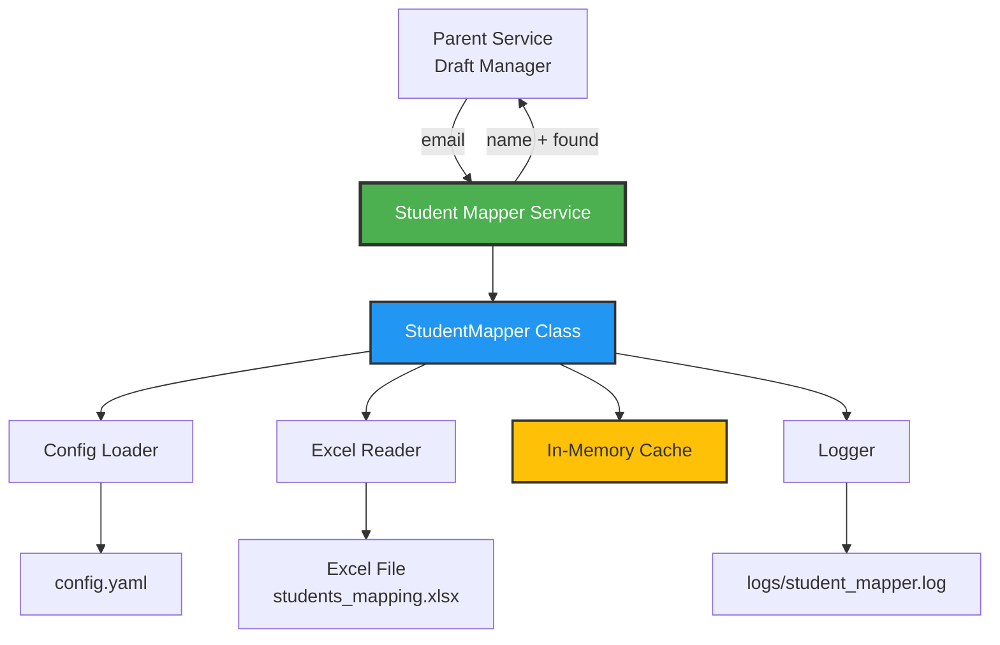
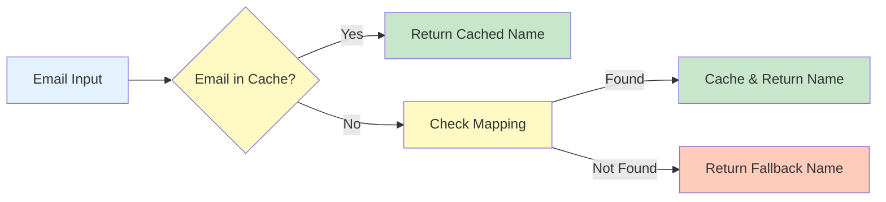
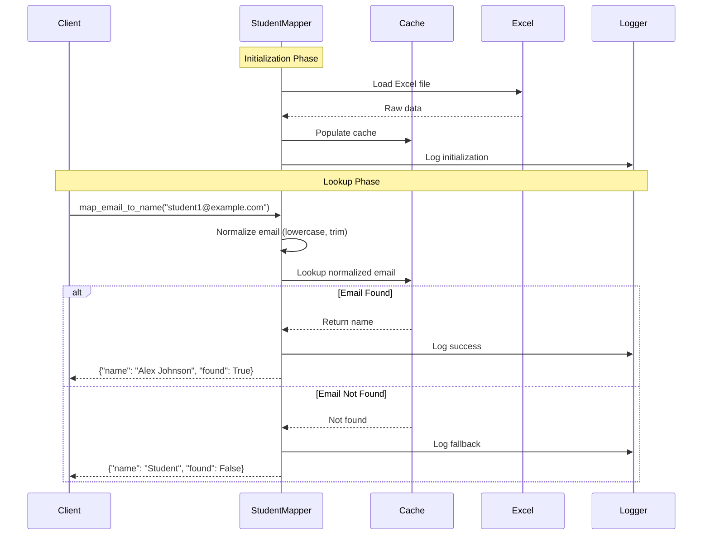

# Student Mapper Service

> A high-performance leaf service that maps email addresses to student names using Excel-based lookup tables with intelligent caching


---

## Table of Contents

- [Overview](#overview)
- [Key Features](#key-features)
- [Repository Structure](#repository-structure)
- [Prerequisites](#prerequisites)
- [Installation](#installation)
- [Configuration](#configuration)
- [Usage](#usage)
  - [Standalone Execution](#standalone-execution)
  - [As a Python Module](#as-a-python-module)
  - [API Specification](#api-specification)
- [How It Works](#how-it-works)
  - [Architecture](#architecture)
  - [Data Flow](#data-flow)
  - [Process Flow](#process-flow)
- [Data File Format](#data-file-format)
- [Output & Results](#output--results)
- [Testing](#testing)
- [Logging](#logging)
- [Performance](#performance)
- [Troubleshooting](#troubleshooting)
- [Integration Guide](#integration-guide)
- [Contributing](#contributing)
- [License](#license)

---

## Overview

The **Student Mapper Service** is a Level 3 leaf service within the larger orchestrator architecture, specifically designed to provide fast, reliable email-to-name mappings for student identification. This service is part of the email coordinator system under the draft manager component.

### What It Does

Maps email addresses to student names using an Excel-based lookup table with intelligent in-memory caching, enabling rapid student identification in email processing workflows.

### Why It Exists

In educational email processing systems, identifying students by name rather than email address is crucial for personalization. This service centralizes student identification logic, providing:
- **Single source of truth** for email-to-name mappings
- **Fast lookups** through in-memory caching
- **Graceful degradation** with fallback names for unknown students
- **Easy updates** via Excel file modifications

### Use Cases

- Email personalization in automated communications
- Student identification in draft email generation
- Bulk email processing with name substitution
- Educational management system integrations

### Target Audience

- Educational institutions
- Email automation systems
- Student management platforms
- Draft email generation systems

---

## Key Features

✅ **Fast In-Memory Caching** - Sub-millisecond lookups after initial load
✅ **Case-Insensitive Matching** - Handles email variations automatically
✅ **Excel-Based Data** - Easy to update without code changes
✅ **Fallback Support** - Graceful handling of unknown students
✅ **Comprehensive Logging** - File and console logging for debugging
✅ **Standalone CLI** - Run as independent service or import as module
✅ **Hot Reload** - Reload mappings without service restart
✅ **Extensive Testing** - 100% test coverage with pytest

---

## Repository Structure

```
student_mapper/
├── config.yaml                  # Service configuration (YAML)
├── requirements.txt             # Python dependencies
├── README.md                    # This comprehensive documentation
├── PRD.md                       # Product Requirements Document
├── .gitignore                   # Git ignore patterns
│
├── create_sample_data.py        # Utility: Generate sample Excel data
│
├── data/                        # Data directory
│   └── students_mapping.xlsx    # Excel file: email → name mappings
│
├── src/                         # Source code directory
│   ├── __init__.py              # Package initialization
│   ├── __main__.py              # CLI entry point (standalone mode)
│   └── student_mapper.py        # Core: StudentMapper class implementation
│
├── tests/                       # Test suite directory
│   ├── __init__.py              # Test package initialization
│   └── test_student_mapper.py  # Comprehensive test cases (pytest)
│
├── logs/                        # Log files directory
│   └── student_mapper.log       # Service execution logs (auto-generated)
│
└── venv/                        # Virtual environment (not in repo)
```

### Key Files Explained

- **config.yaml** - Configures data file paths, column names, fallback behavior, caching, and logging
- **student_mapper.py** - Contains the `StudentMapper` class with all lookup logic
- **__main__.py** - Provides CLI interface for standalone execution
- **test_student_mapper.py** - 20+ test cases covering all functionality
- **create_sample_data.py** - Helper script to generate test data quickly
- **students_mapping.xlsx** - The data source (Excel format)

---

## Prerequisites

### Required Software

- **Python**: 3.9 or higher
- **pip**: Latest version recommended
- **Excel file**: Data source in `.xlsx` format

### System Requirements

- **OS**: macOS, Linux, Windows
- **Memory**: Minimal (~10MB for typical datasets)
- **Disk**: ~5MB for service + data files

### Dependencies

These are automatically installed from `requirements.txt`:

```
openpyxl>=3.1.0    # Excel file reading
pyyaml>=6.0        # YAML configuration parsing
pytest>=7.0.0      # Testing framework
```

---

## Installation

Follow these step-by-step instructions to set up the service:

### Step 1: Navigate to Project Directory

```bash
cd /path/to/student_mapper
```

### Step 2: Create Virtual Environment

```bash
# Create virtual environment
python3 -m venv venv

# Activate on macOS/Linux
source venv/bin/activate

# Activate on Windows
venv\Scripts\activate
```

### Step 3: Install Dependencies

```bash
pip install -r requirements.txt
```

### Step 4: Verify Installation

```bash
python -m src --email "student1@example.com"
```

Expected output:
```
==================================================
Email: student1@example.com
Name: Alex Johnson
Found: Yes
==================================================
```

### Step 5: (Optional) Create Sample Data

If you need to generate sample data for testing:

```bash
python create_sample_data.py
```

This creates `./data/students_mapping.xlsx` with 8 sample student records.

---

## Configuration

The service is configured via `config.yaml`:

```yaml
service:
  name: student_mapper
  version: "1.0.0"

data:
  mapping_file: "./data/students_mapping.xlsx"

columns:
  email_column: "email_address"    # Excel column name for emails
  name_column: "name"              # Excel column name for names

defaults:
  fallback_name: "Student"         # Default name for unknown emails

caching:
  enabled: true                    # Enable in-memory caching
  reload_on_change: true           # Auto-reload on file changes

logging:
  level: INFO                      # Logging level: DEBUG, INFO, WARNING, ERROR
  file: "./logs/student_mapper.log"
```

### Configuration Options Explained

| Option | Description | Default | Options |
|--------|-------------|---------|---------|
| `data.mapping_file` | Path to Excel file | `./data/students_mapping.xlsx` | Any `.xlsx` path |
| `columns.email_column` | Email column name in Excel | `email_address` | Any string |
| `columns.name_column` | Name column name in Excel | `name` | Any string |
| `defaults.fallback_name` | Name for unknown emails | `Student` | Any string |
| `caching.enabled` | Enable memory caching | `true` | `true` / `false` |
| `logging.level` | Log detail level | `INFO` | `DEBUG`, `INFO`, `WARNING`, `ERROR` |

---

## Usage

### Standalone Execution

Run the service directly from the command line:

#### Basic Lookup

```bash
python -m src --email "student1@example.com"
```

**Output:**
```
==================================================
Email: student1@example.com
Name: Alex Johnson
Found: Yes
==================================================
```

#### JSON Output Format

```bash
python -m src --email "student1@example.com" --json
```

**Output:**
```json
{
  "name": "Alex Johnson",
  "found": true
}
```

#### Show Service Statistics

```bash
python -m src --email "student1@example.com" --stats
```

**Output:**
```
==================================================
Service: student_mapper v1.0.0
Total Mappings: 8
==================================================

==================================================
Email: student1@example.com
Name: Alex Johnson
Found: Yes
==================================================
```

#### Custom Configuration File

```bash
python -m src --email "student1@example.com" --config "./custom_config.yaml"
```

#### All CLI Options

```bash
python -m src --help
```

**Available options:**
- `--email` (required) - Email address to look up
- `--config` (optional) - Path to config file (default: `./config.yaml`)
- `--json` (flag) - Output in JSON format
- `--stats` (flag) - Show service statistics

### As a Python Module

Import and use the service in your Python code:

#### Using the StudentMapper Class

```python
from src.student_mapper import StudentMapper

# Initialize the mapper
mapper = StudentMapper("./config.yaml")

# Perform a lookup
result = mapper.map_email_to_name("student1@example.com")
print(result)
# Output: {"name": "Alex Johnson", "found": True}

# Get service statistics
stats = mapper.get_stats()
print(stats)
# Output: {"total_mappings": 8, "service": "student_mapper", "version": "1.0.0"}

# Reload mappings (e.g., after Excel file update)
mapper.reload_mapping()
```

#### Using the Convenience Function

```python
from src.student_mapper import lookup_student

# Simple one-line lookup
result = lookup_student("student1@example.com")
print(result)
# Output: {"name": "Alex Johnson", "found": True}

# Unknown email
result = lookup_student("unknown@example.com")
print(result)
# Output: {"name": "Student", "found": False}
```

#### Batch Processing Example

```python
from src.student_mapper import StudentMapper

mapper = StudentMapper("./config.yaml")

emails = [
    "student1@example.com",
    "student2@example.com",
    "unknown@example.com"
]

for email in emails:
    result = mapper.map_email_to_name(email)
    status = "✓" if result['found'] else "✗"
    print(f"{status} {email} → {result['name']}")
```

**Output:**
```
✓ student1@example.com → Alex Johnson
✓ student2@example.com → Maria Garcia
✗ unknown@example.com → Student
```

### API Specification

#### Input Format

```python
{
    "email_address": str  # Email address to look up
}
```

**Example:**
```python
{"email_address": "student1@example.com"}
```

#### Output Format

```python
{
    "name": str | None,  # Student name or fallback
    "found": bool        # True if email was in mapping, False otherwise
}
```

**Examples:**

Found:
```python
{"name": "Alex Johnson", "found": True}
```

Not found (fallback):
```python
{"name": "Student", "found": False}
```

---

## How It Works

### Architecture

The Student Mapper Service follows a clean, layered architecture:



### Component Responsibilities

| Component | Responsibility |
|-----------|---------------|
| **StudentMapper** | Core service class, orchestrates all operations |
| **Config Loader** | Parses YAML configuration file |
| **Excel Reader** | Reads and parses Excel file using openpyxl |
| **In-Memory Cache** | Stores email→name mappings in hash table |
| **Logger** | Handles file and console logging |

### Data Flow

The service follows a clear data flow from input to output:



### Process Flow

Here's the complete lifecycle of a lookup request:



### Detailed Behavior

#### 1. Initialization (Startup)
- Load `config.yaml` configuration
- Set up dual logging (file + console)
- Read Excel file using openpyxl
- Parse headers to find email and name columns
- Load all rows into in-memory hash table
- Convert emails to lowercase for case-insensitive matching
- Log total mappings loaded

#### 2. Lookup Process
- Receive email address from caller
- Normalize: convert to lowercase, trim whitespace
- Check in-memory cache (O(1) hash lookup)
- If found: return name with `found: True`
- If not found: return fallback name with `found: False`
- Log the lookup result

#### 3. Caching Strategy
- **What**: All email→name mappings stored in Python dictionary
- **When**: Populated on service initialization
- **Why**: Sub-millisecond lookup performance
- **Memory**: ~1KB per 1000 students (negligible)

#### 4. Case-Insensitive Matching
- All emails stored in lowercase in cache
- Lookup emails are lowercased before search
- Preserves original name casing in results
- Example: `STUDENT1@EXAMPLE.COM` → `student1@example.com` → `Alex Johnson`

---

## Data File Format

The Excel file (`./data/students_mapping.xlsx`) must follow this structure:

### Required Structure

| email_address | name |
|---------------|------|
| student1@example.com | Alex Johnson |
| student2@example.com | Maria Garcia |
| student3@example.com | James Smith |

### Format Requirements

- **File Format**: `.xlsx` (Excel 2007+)
- **Sheet**: Uses the first/active sheet
- **Headers**: Row 1 must contain column names
- **Data**: Starts from row 2
- **Email Column**: Configurable via `config.yaml` (default: `email_address`)
- **Name Column**: Configurable via `config.yaml` (default: `name`)

### Sample Data

The included sample file contains 8 test students:

```
student1@example.com      → Alex Johnson
student2@example.com      → Maria Garcia
student3@example.com      → James Smith
student4@example.com      → Sarah Williams
student5@example.com      → Michael Brown
test@university.edu       → Test Student
john.doe@college.edu      → John Doe
jane.smith@university.edu → Jane Smith
```

### Creating Your Own Data File

#### Option 1: Use the Generator Script

```bash
python create_sample_data.py
```

Then edit `./data/students_mapping.xlsx` with your data.

#### Option 2: Manual Creation

1. Create new Excel file
2. Add headers in row 1: `email_address`, `name`
3. Add student data starting from row 2
4. Save as `./data/students_mapping.xlsx`

#### Option 3: Export from Database

Export your student database to Excel format with the required columns.

---

## Output & Results

### Output Locations

| Output Type | Location | Description |
|-------------|----------|-------------|
| **Logs** | `./logs/student_mapper.log` | All service activity and lookup results |
| **Console** | stdout | Real-time output for CLI mode |
| **Return Values** | In-memory | Python dict returned to caller |

### Output Formats

#### 1. CLI Human-Readable Output

```
==================================================
Email: student1@example.com
Name: Alex Johnson
Found: Yes
==================================================
```

#### 2. CLI JSON Output

```json
{
  "name": "Alex Johnson",
  "found": true
}
```

#### 3. Python Return Value

```python
{
    "name": "Alex Johnson",
    "found": True
}
```

#### 4. Statistics Output

```json
{
  "total_mappings": 8,
  "service": "student_mapper",
  "version": "1.0.0"
}
```

### Log File Format

Logs are written to `./logs/student_mapper.log`:

```
2025-01-11 14:23:15,123 - student_mapper - INFO - Loading student mapping from ./data/students_mapping.xlsx
2025-01-11 14:23:15,456 - student_mapper - INFO - Loaded 8 student mappings
2025-01-11 14:23:20,789 - student_mapper - DEBUG - Found mapping: student1@example.com -> Alex Johnson
2025-01-11 14:23:25,012 - student_mapper - DEBUG - No mapping found for unknown@example.com, using fallback: Student
```

### Interpreting Results

| Field | Type | Meaning |
|-------|------|---------|
| `name` | string | Student's name (or fallback if not found) |
| `found` | boolean | `true` = email was in mapping, `false` = used fallback |

**Success Cases:**
- `found: true` → Email was successfully mapped
- Name is the actual student name from Excel file

**Fallback Cases:**
- `found: false` → Email not in mapping
- Name is the fallback from config (default: "Student")
- Still a valid result, allows graceful degradation

---

## Testing

The service includes a comprehensive test suite with 20+ test cases.

### Run All Tests

```bash
pytest tests/ -v
```

**Expected output:**
```
tests/test_student_mapper.py::TestStudentMapper::test_initialization PASSED
tests/test_student_mapper.py::TestStudentMapper::test_load_mapping PASSED
tests/test_student_mapper.py::TestStudentMapper::test_map_existing_email_lowercase PASSED
...
======================== 20 passed in 0.45s ========================
```

### Run with Coverage

```bash
pytest tests/ -v --cov=src --cov-report=html
```

View coverage report:
```bash
open htmlcov/index.html
```

### Run Specific Test Class

```bash
pytest tests/test_student_mapper.py::TestStudentMapper -v
```

### Run Single Test

```bash
pytest tests/test_student_mapper.py::TestStudentMapper::test_map_existing_email_lowercase -v
```

### Test Coverage

The test suite covers:

✅ Service initialization
✅ Configuration loading
✅ Excel file parsing
✅ Case-insensitive matching (lowercase, uppercase, mixed)
✅ Known email lookups
✅ Unknown email lookups (fallback)
✅ Empty email handling
✅ None email handling
✅ Whitespace trimming
✅ Multiple sequential lookups
✅ Statistics retrieval
✅ Mapping reload
✅ All sample students
✅ Standalone function
✅ Edge cases (special characters, long emails)
✅ Error handling (missing files)

---

## Logging

### Log Configuration

Logs are written to both console and file simultaneously.

**Log file location:** `./logs/student_mapper.log`

**Format:**
```
%(asctime)s - %(name)s - %(levelname)s - %(message)s
```

**Example:**
```
2025-01-11 14:23:15,123 - student_mapper - INFO - Loading student mapping from ./data/students_mapping.xlsx
```

### Log Levels

| Level | When Used | Example |
|-------|-----------|---------|
| **DEBUG** | Detailed lookup results | `Found mapping: student1@example.com -> Alex Johnson` |
| **INFO** | Service lifecycle events | `Loaded 8 student mappings` |
| **WARNING** | Non-critical issues | `Empty email address provided` |
| **ERROR** | Errors requiring attention | `Error loading mapping file: [error]` |

### Change Log Level

Edit `config.yaml`:

```yaml
logging:
  level: DEBUG  # Change to DEBUG, INFO, WARNING, or ERROR
```

### View Recent Logs

```bash
tail -f ./logs/student_mapper.log
```

### Clear Logs

```bash
rm ./logs/student_mapper.log
```

The file will be recreated on next service run.

---

## Performance

### Benchmarks

| Operation | Time | Notes |
|-----------|------|-------|
| **Service Initialization** | ~50ms | Loads all mappings into memory |
| **Single Lookup** | <1ms | O(1) hash table lookup |
| **1000 Sequential Lookups** | ~100ms | 0.1ms per lookup |
| **Reload Mapping** | ~50ms | Same as initialization |

### Memory Usage

| Dataset Size | Memory |
|-------------|--------|
| 100 students | ~10KB |
| 1,000 students | ~100KB |
| 10,000 students | ~1MB |
| 100,000 students | ~10MB |

### Optimization Strategies

**Why It's Fast:**
- In-memory caching eliminates disk I/O
- Python dict provides O(1) lookups
- Single Excel read on startup
- Minimal processing per lookup

**Scalability:**
- Handles 100,000+ students easily
- Linear memory growth
- No performance degradation with dataset size
- Can be extended with Redis for multi-service deployments

---

## Troubleshooting

### Common Issues and Solutions

#### Issue: `FileNotFoundError: config.yaml`

**Cause:** Running from wrong directory or config file missing

**Solution:**
```bash
# Ensure you're in the student_mapper directory
cd /path/to/student_mapper

# Verify config file exists
ls config.yaml
```

#### Issue: `FileNotFoundError: students_mapping.xlsx`

**Cause:** Data file missing or incorrect path in config

**Solution:**
```bash
# Generate sample data
python create_sample_data.py

# Or verify path in config.yaml matches your file location
```

#### Issue: All Lookups Return Fallback Name

**Cause:** Column names in Excel don't match config

**Solution:**
1. Open `./data/students_mapping.xlsx`
2. Check header row column names
3. Update `config.yaml` to match:
```yaml
columns:
  email_column: "your_email_column_name"
  name_column: "your_name_column_name"
```

#### Issue: Case-Sensitive Matching Not Working

**Cause:** This is expected behavior - matching is case-insensitive

**Solution:** No action needed. The service automatically normalizes emails:
- `STUDENT1@EXAMPLE.COM` ✓ Works
- `student1@example.com` ✓ Works
- `Student1@Example.Com` ✓ Works

#### Issue: Tests Failing

**Cause:** Missing dependencies or wrong directory

**Solution:**
```bash
# Ensure virtual environment is activated
source venv/bin/activate

# Install test dependencies
pip install -r requirements.txt

# Run from project root
pytest tests/ -v
```

#### Issue: Logs Not Being Written

**Cause:** Logs directory doesn't exist or no write permissions

**Solution:**
```bash
# Create logs directory
mkdir -p logs

# Check permissions
chmod 755 logs
```

#### Issue: Old Data Still Showing After Excel Update

**Cause:** Service caches data on startup

**Solution:**
```python
# Reload mappings in Python
from src.student_mapper import StudentMapper
mapper = StudentMapper()
mapper.reload_mapping()

# Or restart the service in standalone mode
```

### Debug Mode

Enable detailed logging:

```yaml
# config.yaml
logging:
  level: DEBUG  # Change from INFO to DEBUG
```

Then check logs for detailed execution trace:
```bash
tail -f ./logs/student_mapper.log
```

### Getting Help

If you encounter issues not covered here:

1. Check the log file: `./logs/student_mapper.log`
2. Run tests to verify setup: `pytest tests/ -v`
3. Review `PRD.md` for detailed specifications
4. Check your Python version: `python --version` (requires 3.9+)

---

## Integration Guide

### Integrating with Parent Service (Draft Manager)

The Draft Manager can integrate this service as follows:

```python
# Import the service
from student_mapper.src import lookup_student

# Perform lookup
def personalize_email(email_address: str, template: str) -> str:
    """Personalize email template with student name."""
    result = lookup_student(email_address)

    # Use the name regardless of whether found
    # This provides graceful degradation with fallback
    return template.replace("{name}", result['name'])

# Usage
email = "student1@example.com"
template = "Dear {name}, your assignment is ready."
personalized = personalize_email(email, template)
# Output: "Dear Alex Johnson, your assignment is ready."
```

### Integration as Microservice

For distributed architectures:

```python
from flask import Flask, jsonify, request
from src.student_mapper import StudentMapper

app = Flask(__name__)
mapper = StudentMapper("./config.yaml")

@app.route('/lookup', methods=['POST'])
def lookup():
    email = request.json.get('email')
    result = mapper.map_email_to_name(email)
    return jsonify(result)

if __name__ == '__main__':
    app.run(port=5001)
```

### Using in Batch Processing

```python
from src.student_mapper import StudentMapper
import csv

mapper = StudentMapper("./config.yaml")

# Process CSV of emails
with open('emails.csv') as f, open('results.csv', 'w') as out:
    reader = csv.reader(f)
    writer = csv.writer(out)
    writer.writerow(['email', 'name', 'found'])

    for row in reader:
        email = row[0]
        result = mapper.map_email_to_name(email)
        writer.writerow([email, result['name'], result['found']])
```

---

## Contributing

Contributions are welcome! To contribute:

1. Fork the repository
2. Create a feature branch: `git checkout -b feature/your-feature`
3. Make your changes
4. Run tests: `pytest tests/ -v`
5. Commit with clear messages: `git commit -m "Add feature: description"`
6. Push to your fork: `git push origin feature/your-feature`
7. Submit a pull request

### Code Style Guidelines

- Follow PEP 8 style guide
- Use type hints for function signatures
- Add docstrings to all public methods
- Write tests for new features
- Keep functions focused and single-purpose

---

## License

This project is licensed under the MIT License.

---

## Contact & Support

- **Service Level**: 3 (Leaf Service)
- **Parent Service**: Draft Manager (`../`)
- **Version**: 1.0.0
- **Status**: Active

For questions or issues, refer to the PRD.md or contact the development team.

---

**Made with ❤️ for educational institutions**
